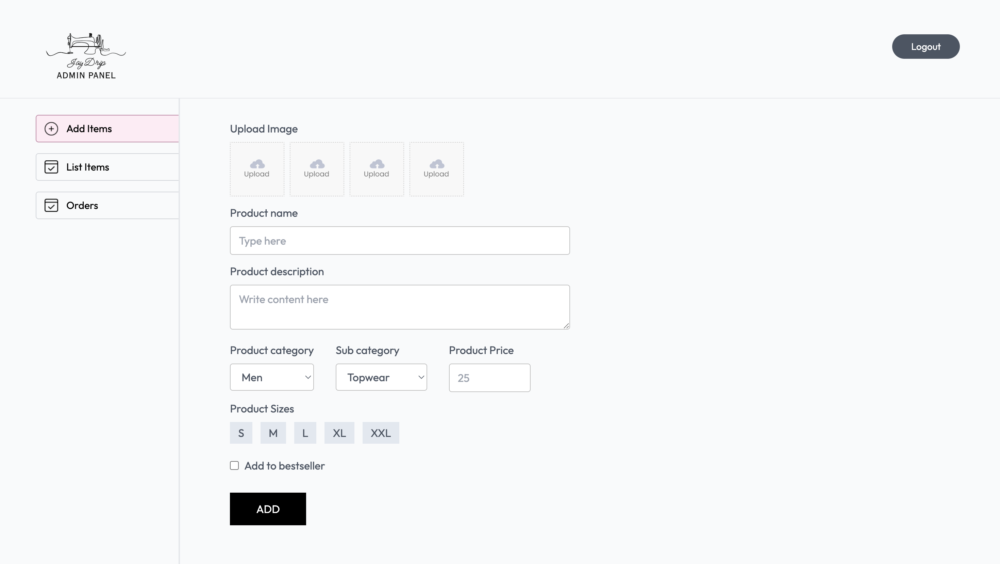
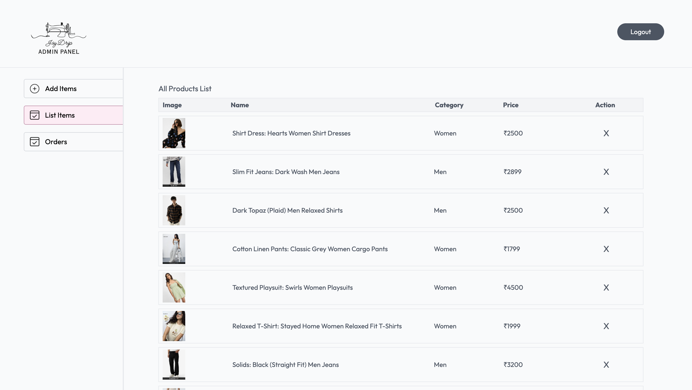
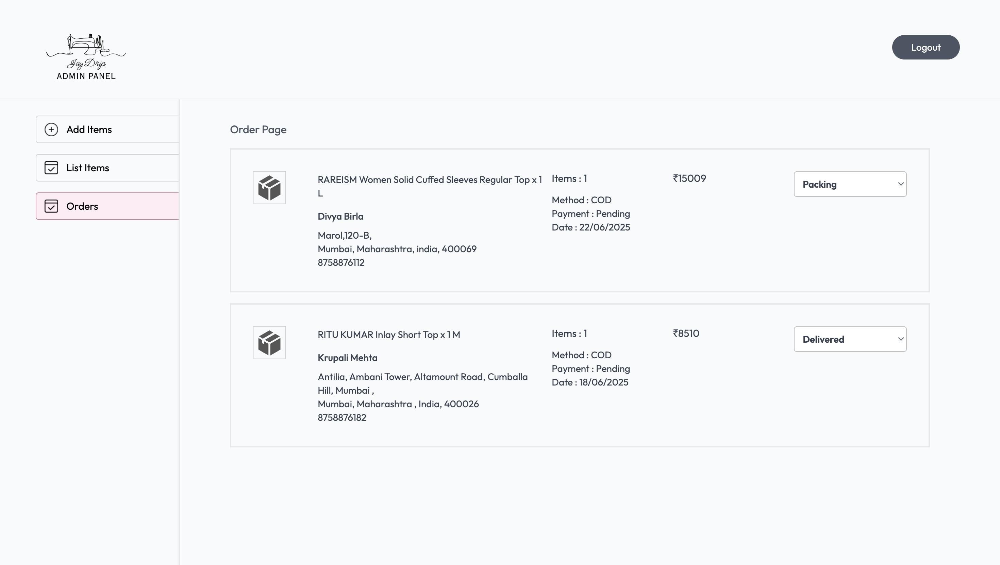

# 👕 Jay Drip — Full Stack Clothing E-commerce Website

Jay Drip is a modern, full-featured clothing e-commerce platform built with the **MERN Stack** (MongoDB, Express.js, React.js, Node.js). It allows users to browse products by category, manage carts and orders, and securely checkout with **Stripe** or **Cash on Delivery (COD)**. Admins can manage inventory and orders through a dedicated panel.

---

## 🔥 Features

- 👨‍👩‍👧‍👦 Category-wise Browsing: Men, Women, Kids
- 👕 Product Categories: Topwear, Bottomwear, Winterwear
- 🛒 Add to Cart, Order Placement
- 💳 Stripe Payment Gateway + COD
- 📦 Admin Panel for Inventory Management

---

## 🏠 Home Page

|  |  |
|-----------------------------|------------------------------|
|  |  |

---

## 🛍️ Product Listing


---

## 🛠️ Admin Panel

|  |  |
|------------------------------|-------------------------------|
|  |


---

## 🚀 Getting Started

```bash
# Clone the repo
git clone https://github.com/jaymehta9/JayDrip.git

# Install backend dependencies
cd backend && npm install

# Install frontend dependencies
cd ../frontend && npm install

# Run both servers (use concurrently or run separately)


Created with ❤️ by Jay Mehta